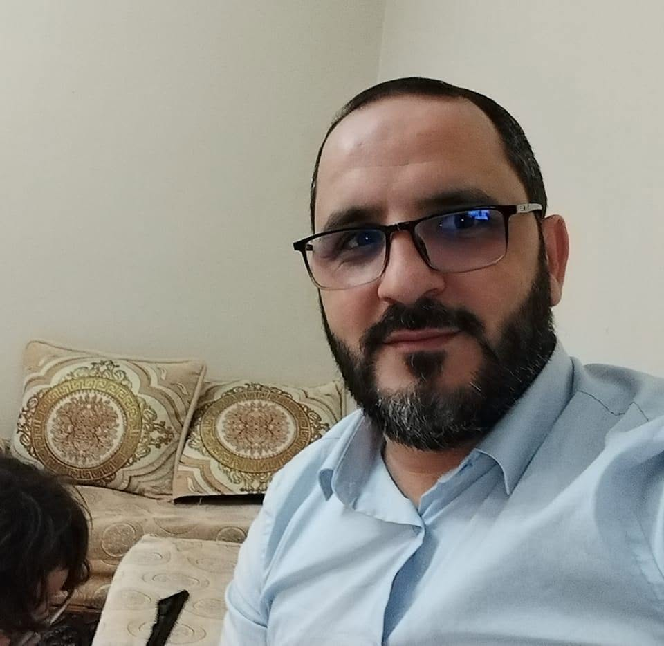
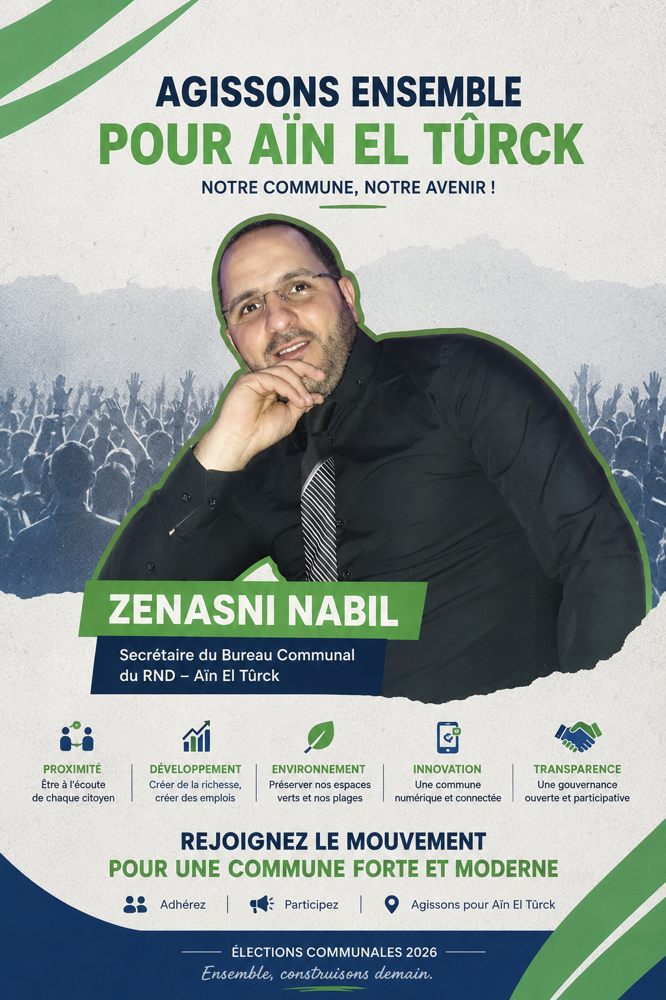
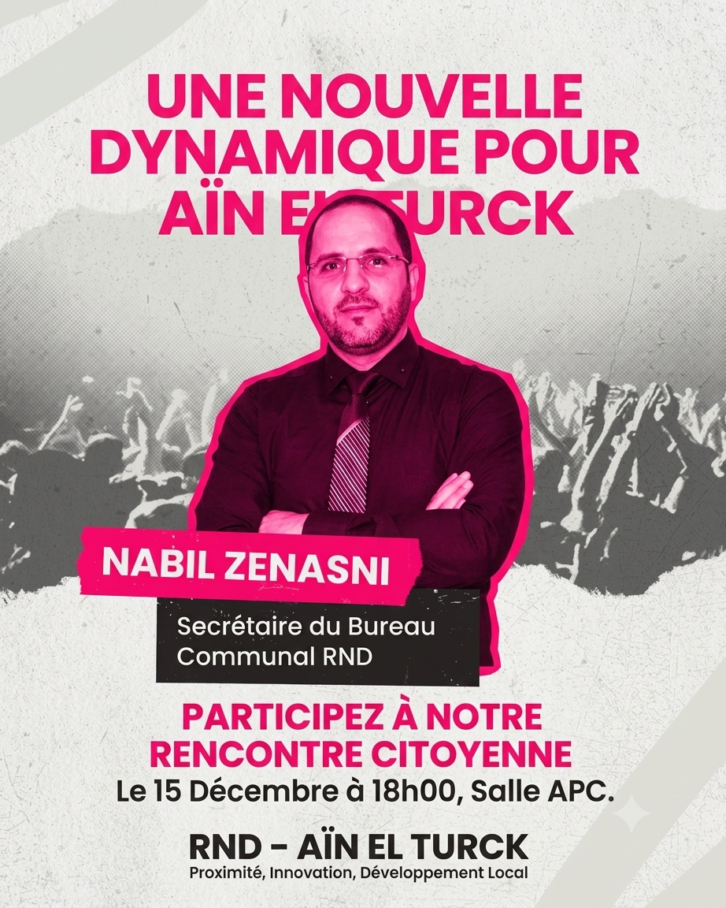
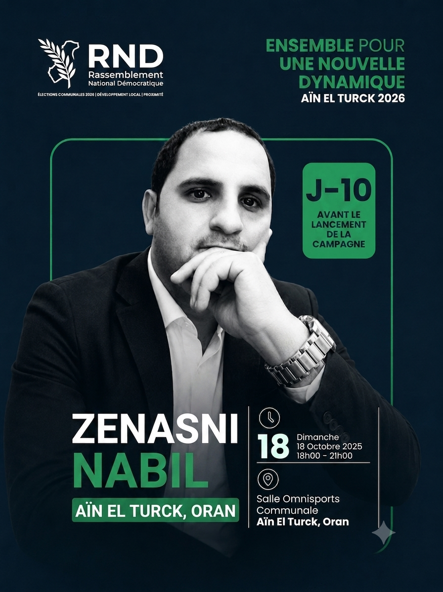

# RNDAET — Campagne Municipale 2026

Application officielle de campagne de **Nabil Zenasni**, secrétaire du bureau communal du RND (Rassemblement National Démocratique) à **Aïn El Turck, Oran**.

<p align="center">
  
  
</p>

## Fonctionnalités

- **Accueil** — Présentation du candidat, message audio (FR/AR), statistiques du RND
- **Candidat** — Biographie, vision, valeurs
- **Programme** — 6 piliers thématiques (Économie, Transport, Tourisme, Environnement, Numérique, Gouvernance)
- **Adhésion** — Formulaire d'adhésion au mouvement
- **Événements** — Calendrier des événements de campagne
- **Auth** — Connexion / Inscription par email
- **i18n** — 3 langues : Français, Arabe, Anglais (support RTL)

## Captures d'écran

<p align="center">
  
  
  
</p>

## Audio

Message de campagne disponible en **Français** et **Arabe** :

| Langue | Fichier |
|--------|---------|
| Français | `assets/audio/fr.mp3` |
| Arabe | `assets/audio/ar.mp3` |

## Prérequis

- Flutter >= 3.6.0
- Compte Supabase

## Installation

```bash
# Copier le fichier d'environnement
cp .env.example .env
# Éditer .env avec vos clés Supabase

# Lancer l'application
flutter run --dart-define-from-file=.env
```

## Build release

```bash
flutter build apk --release --dart-define-from-file=.env
flutter build appbundle --release --dart-define-from-file=.env
```

## Stack technique

- **Flutter** — UI framework
- **Supabase** — Backend (Auth, Database)
- **Provider** — State management
- **flutter_map** — Cartographie
- **audioplayers** — Audio
- **google_fonts** — Typographie
- **l10n** — Internationalisation (FR/AR/EN)

## Licence

Projet privé — RND

---

© Developed by **FORSLOG LTD** — Codded by **Ramzy Guedouar** — Contact: **0696 41 09 53**
