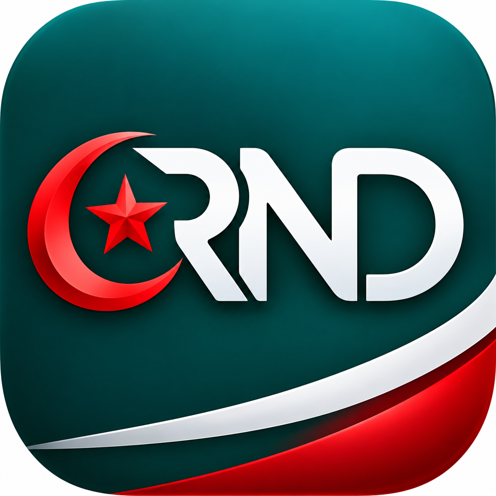

# RND Ain El Turck — Campagne Municipale 2026

Application officielle de campagne de **Zenasni Nabil**, secrétaire du bureau communal du RND (Rassemblement National Démocratique) à **Aïn El Turck, Oran**.

Réécrite en **React 19 + TypeScript + Vite + Tailwind CSS** avec le thème moderne mobile-first inspiré des créations Purrweb (formes organiques chaleureuses, pastels doux, cartes superposées, lecteur audio candidat interactif et barre de navigation pill).

<p align="center">
  
  
</p>

## ✨ Fonctionnalités Réécrites

- **Accueil (Home)** — Présentation du candidat, avatar encadré avec badge étoilé, allocution audio interactive intégrée (FR/AR), statistiques clés du RND (451 Mairies, 6 521 Élus, 58 Députés, 28 Années), aperçu des piliers en cartes pastel superposées, valeurs fondamentales et actualités.
- **Le Candidat** — Biographie complète, vision d'avenir, engagement solennel pour Aïn El Turck, écoute du discours audio officiel.
- **Programme Électoral** — Les 6 piliers majeurs avec 50+ actions concrètes détaillées, filtres par domaine (Économie, Mobilité, Tourisme, Écologie, Numérique, Gouvernance) et engagement moral tripartite.
- **Adhésion Citoyenne** — Formulaire officiel d'adhésion au mouvement avec validation réactive des champs (nom, email, téléphone, quartier, suggestions), sauvegarde locale et confirmation modale.
- **Agenda & Événements** — Calendrier des rencontres citoyennes et meetings populaires avec formatage multilingue des dates.
- **Authentification** — Connexion, inscription citoyenne, récupération de mot de passe, et connexion rapide Google.
- **Internationalisation (i18n)** — 3 langues disponibles : Français (`fr`), Arabe (`ar` avec prise en charge intégrale de la mise en page RTL et polices arabes Noto Sans / Cairo), et Anglais (`en`).
- **Lecteur Audio Intégré** — Lecture fluide du message vocal du candidat (`fr.mp3` ou `ar.mp3`) avec barres égaliseurs animées.

## 🛠️ Stack Technique

- **Framework** : React 19, TypeScript
- **Bundler** : Vite 6
- **Styling** : Tailwind CSS v4 (palette warm sand, pastels, pill components)
- **Icônes** : Lucide React
- **Audio** : Lecteur HTML5 Audio dynamique selon la langue
- **State & i18n** : Context API (`LanguageContext`, `AuthContext`)

## 🚀 Démarrage Rapide

```bash
# Installation des dépendances
npm install

# Lancement du serveur de développement (port 3000)
npm run dev

# Build de production
npm run build
```

---

© Développé par **FORSLOG LTD** — Codé par **Ramzy Guedouar** — Contact : **0696 41 09 53**
